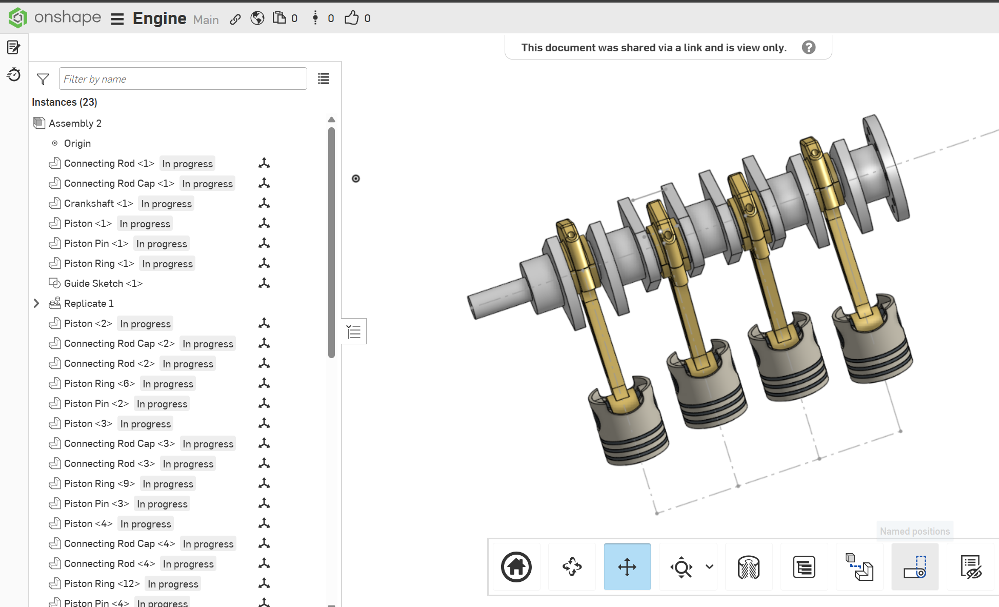

# Inline4Engine

A 4-cylinder inline engine, modeled in Onshape.

[View in Onshape](https://cad.onshape.com/documents/50798ee7d6604e639f0605f9/w/0e47851a6c48e6507d6d3f80/e/480cccb0063886784bc267cc)

**Built with:** Onshape CAD

## Overview

Crankshaft, connecting rod, connecting rod cap, piston, piston pin, and piston ring, and 4 cylinders. Can animate in assembly. 

## Parts

- Crankshaft
- Connecting Rod
- Connecting Rod Cap
- Piston
- Piston Pin
- Piston Ring

(./media/crank-detail.png)

