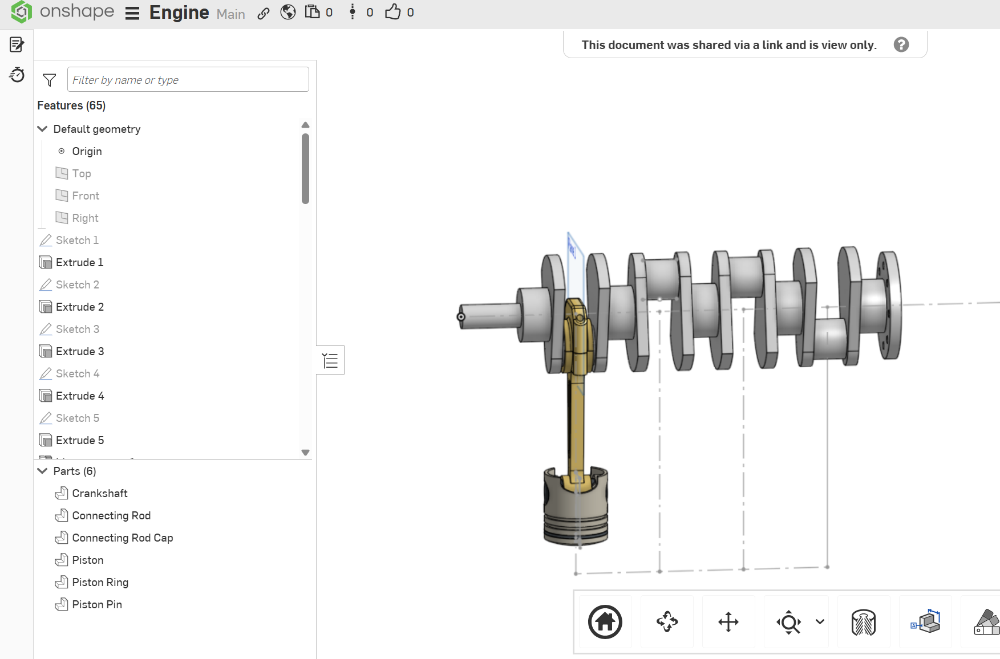

# Inline4Engine

A 4-cylinder inline engine, modeled in Onshape.

[View in Onshape](https://cad.onshape.com/documents/50798ee7d6604e639f0605f9/w/0e47851a6c48e6507d6d3f80/e/480cccb0063886784bc267cc)

**Built with:** Onshape CAD

**Status:** Work in progress. Geometry is modeled, mates and motion aren't set up yet. Updating this as I keep working on it.

## Overview

Crankshaft, connecting rod, connecting rod cap, piston, piston pin, and piston ring, modeled once as a single cylinder, then patterned around the crankshaft using Onshape's Replicate feature along a guide sketch to build out all 4 cylinders.

## Parts

- Crankshaft
- Connecting Rod
- Connecting Rod Cap
- Piston
- Piston Pin
- Piston Ring

## What's Next

- Add mates connecting each crank throw to its rod and piston (revolute joints at the rod ends, a slider/cylindrical mate keeping each piston moving in a straight line)
- Get the assembly animating once the mates are in, so the crank rotation drives the pistons
- More screenshots/renders as it progresses
